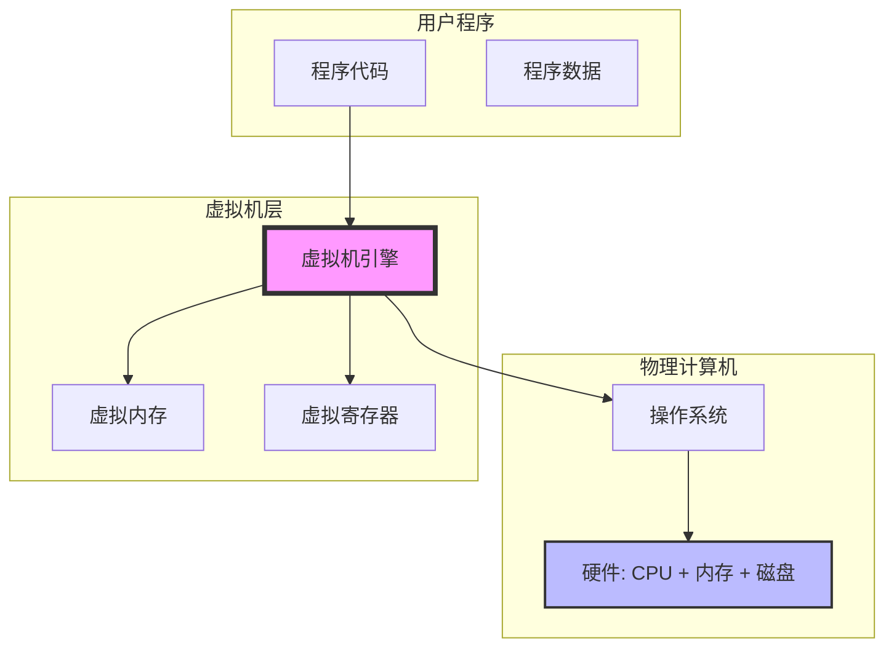
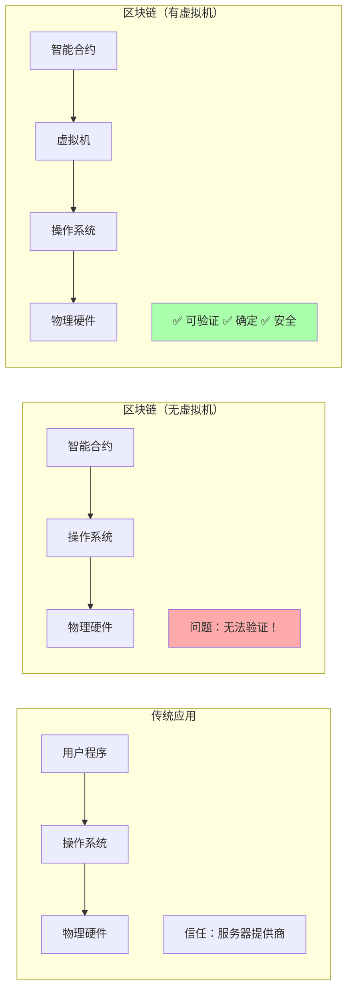

# 第一章：开篇 - 为什么需要虚拟机？

> 从"如果你想造一台安全的计算机"讲起

---

## 📖 本章导航

- [故事的开始：三大挑战](#故事的开始三大挑战)
- [虚拟机：沙盒中的计算世界](#虚拟机沙盒中的计算世界)
- [区块链为什么离不开虚拟机](#区块链为什么离不开虚拟机)
- [CKB-VM 的使命](#ckb-vm-的使命)

---

## 🎭 故事的开始：三大挑战

想象一下，你是一位区块链的守护者。你的任务是让成千上万的人在同一个"世界"里执行各种各样的程序：

- 👤 Alice 想转账给 Bob
- 🏢 Carol 想创建一个去中心化的交易所
- 🎮 Dave 想运行一个链上游戏
- 🔐 Eve 想部署新的加密算法

但问题来了...

### ⚠️ 挑战 1：信任危机

**问题**：你怎么知道这些程序不会偷偷做坏事？

```c
// 恶意程序示例：无限循环
while (1) {
    // 耗尽所有资源，让整个区块链停止工作！
}
```

```c
// 恶意程序示例：访问不该访问的内存
char* secret = (char*)0x12345678;  // 随机地址
printf("%s", secret);  // 可能泄露敏感数据！
```

**后果**：
- 💣 恶意程序可能耗尽资源（DOS 攻击）
- 🔓 可能窃取其他用户的数据
- 💥 可能破坏整个系统

---

### ⚠️ 挑战 2：确定性魔咒

**问题**：区块链有个"铁律" - **同样的输入必须产生同样的输出**

为什么？因为全网的节点需要验证交易，如果每个节点计算结果不一样，就无法达成共识！

**真实案例：浮点数陷阱**

```c
// 在不同 CPU 上可能有不同结果！
double a = 0.1 + 0.2;
if (a == 0.3) {  // 在某些平台上是 false！
    printf("Equal\n");
} else {
    printf("Not equal\n");
}
```

```
Intel CPU:   0.30000000000000004 ≠ 0.3
ARM CPU:     0.30000000000000004 ≠ 0.3
RISC-V CPU:  0.30000000000000004 ≠ 0.3
```

即使都不相等，但如果精度不同，验证还是会失败！

**更多不确定性来源**：
- 操作系统差异（Windows vs Linux）
- 编译器版本差异（GCC 9 vs GCC 13）
- 硬件差异（Intel vs AMD vs ARM）
- 时间相关函数（`time()`, `rand()`）

---

### ⚠️ 挑战 3：性能焦虑

**问题**：虚拟机要足够快，否则用户体验很糟糕

**性能对比**（相同计算任务）：

```
直接运行本地代码：      1.0x （基准）
JVM（Java 虚拟机）：     0.7x （慢 30%）
Python 解释器：         0.1x （慢 10 倍）
某些区块链虚拟机：       0.01x（慢 100 倍）😱
```

**影响**：
- ⏱️ 交易确认时间过长
- 💰 Gas 费用过高
- 😤 用户体验差，开发者流失

---

## 🏰 虚拟机：沙盒中的计算世界

### 什么是虚拟机？

**简单类比**：虚拟机就像一个"计算机模拟器"

```
┌─────────────────────────────────────────┐
│         真实的物理计算机                  │
│  ┌─────────────────────────────────┐   │
│  │       虚拟机（软件模拟）          │   │
│  │  ┌─────────────────────────┐   │   │
│  │  │   用户程序在这里运行      │   │   │
│  │  │   （被虚拟机控制）        │   │   │
│  │  └─────────────────────────┘   │   │
│  │                                 │   │
│  │  ✅ 隔离：无法访问外部资源       │   │
│  │  ✅ 控制：每步都被监控           │   │
│  │  ✅ 确定：行为完全可预测         │   │
│  └─────────────────────────────────┘   │
└─────────────────────────────────────────┘
```

### 虚拟机的工作原理

#### 架构图（Mermaid）



#### 执行流程示例

```python
# 伪代码：虚拟机如何执行一条加法指令

class VirtualMachine:
    def __init__(self):
        self.registers = [0] * 32  # 32 个寄存器
        self.memory = [0] * 1024   # 1KB 内存
        self.pc = 0                # 程序计数器

    def execute_add(self, rd, rs1, rs2):
        # 1. 检查权限（是否允许访问寄存器）
        if not self.check_register_access(rd, rs1, rs2):
            raise SecurityError("非法寄存器访问")

        # 2. 计算（在隔离环境中）
        result = self.registers[rs1] + self.registers[rs2]

        # 3. 检查资源消耗
        self.cycles += 1  # 每条指令计费
        if self.cycles > self.max_cycles:
            raise ResourceError("超出计算限制")

        # 4. 写回结果（在虚拟寄存器中）
        self.registers[rd] = result & 0xFFFFFFFF  # 32位

        # 5. 更新 PC
        self.pc += 4  # 移动到下一条指令
```

**关键点**：
- ✅ **每一步都被监控**：虚拟机控制程序的每个动作
- ✅ **隔离执行**：程序无法直接访问物理硬件
- ✅ **资源计量**：精确计算每条指令的消耗

---

### 虚拟机 vs 直接运行对比

#### 场景：执行一个简单的加法

**直接运行本地代码**：

```c
// C 代码
int add(int a, int b) {
    return a + b;
}

// 编译后的 x86 汇编
mov eax, edi      ; 取参数 a
add eax, esi      ; 加上参数 b
ret               ; 返回

// 执行：CPU 直接运行，1 个时钟周期
```

**问题**：
- ❌ 无法限制资源消耗
- ❌ 无法隔离（可以访问任意内存）
- ❌ 不确定（不同 CPU 可能有差异）

---

**在虚拟机中运行**：

```c
// 同样的 C 代码
int add(int a, int b) {
    return a + b;
}

// 编译为 RISC-V 指令（虚拟机的指令集）
add a0, a0, a1    ; 虚拟指令

// 虚拟机执行（伪代码）
vm.fetch_instruction(pc)       // 1. 取指
vm.decode_instruction()         // 2. 解码
vm.check_permission()           // 3. 权限检查
vm.meter_cycles(1)              // 4. 计费
vm.execute_add(a0, a0, a1)      // 5. 执行
vm.update_pc()                  // 6. 更新 PC

// 执行：约 10-50 个时钟周期（有开销，但换来安全）
```

**好处**：
- ✅ 完全隔离（无法访问虚拟机外的资源）
- ✅ 精确计量（每条指令都计费）
- ✅ 完全确定（在任何平台上结果相同）

---

## 🔗 区块链为什么离不开虚拟机

### 区块链的特殊需求

| 需求 | 传统应用 | 区块链应用 | 解决方案 |
|------|---------|-----------|---------|
| **信任模型** | 信任服务器 | 零信任（不信任任何人） | 虚拟机隔离 |
| **确定性** | 无要求 | 绝对确定（全网一致） | 虚拟机标准化执行 |
| **资源限制** | 操作系统管理 | 必须精确计费 | 虚拟机计量每条指令 |
| **可审计性** | 日志记录 | 完全透明可验证 | 虚拟机状态可追溯 |

---

### 执行环境对比

#### 对比图（Mermaid）



---

### 真实案例：以太坊 EVM

**以太坊虚拟机（EVM）** 是最著名的区块链虚拟机：

```solidity
// Solidity 代码（以太坊智能合约）
contract SimpleStorage {
    uint256 value;

    function set(uint256 newValue) public {
        value = newValue;  // 这行代码在 EVM 中执行
    }
}
```

**EVM 的工作**：
1. 将 Solidity 编译为 EVM 字节码
2. 在隔离环境中执行字节码
3. 计算 Gas 消耗（资源计费）
4. 更新区块链状态

**结果**：
- ✅ 全网节点执行结果完全一致
- ✅ 恶意代码无法破坏系统
- ✅ 资源消耗公平计费

---

## 🎯 CKB-VM 的使命

### CKB-VM 简介

**CKB-VM** 是 Nervos CKB 区块链的虚拟机，它的使命是：

> **在保证安全和确定性的前提下，提供最大的灵活性和最高的性能**

### 设计目标

#### 目标 1：绝对安全

```rust
// CKB-VM 的 WXorX 内存保护
// W^X = Write XOR Execute（内存页要么可写，要么可执行）

// ✅ 允许：执行代码段
let code_page = memory.allocate(PAGE_EXECUTABLE);
vm.execute(code_page);

// ✅ 允许：写入数据段
let data_page = memory.allocate(PAGE_WRITABLE);
memory.write(data_page, data);

// ❌ 禁止：写入后执行（防止代码注入攻击）
let evil_page = memory.allocate(PAGE_WRITABLE);
memory.write(evil_page, malicious_code);
vm.execute(evil_page);  // 💥 错误：违反 WXorX 原则！
```

**安全机制**：
- 🛡️ WXorX 内存保护
- 🔒 沙盒隔离
- 📊 资源限制（Cycles）
- ✅ 权限检查

---

#### 目标 2：完全确定性

```rust
// CKB-VM 的确定性保证

// ✅ 允许：确定性操作
let a = 100;
let b = 200;
let result = a + b;  // 永远是 300

// ❌ 禁止：非确定性操作
let timestamp = system_time();  // ❌ 不同节点时间不同
let random = rand();            // ❌ 随机数不确定
let file = read_file("/etc/passwd");  // ❌ 访问外部资源
```

**确定性来源**：
- 📐 RISC-V 规范严格定义所有行为
- 🚫 禁止系统调用（除非白名单）
- 🔢 整数运算（无浮点数陷阱）
- 📦 固定的执行环境

---

#### 目标 3：高性能

**CKB-VM 的性能优化**（后续章节详细讲解）：

```
性能对比（相同计算任务）：

直接运行本地代码：       1.0x  （基准）
CKB-VM (ASM 模式)：      0.8x  （仅慢 20%！）⚡
CKB-VM (解释器模式)：    0.3x  （慢 3 倍，但仍可接受）
以太坊 EVM：             0.1x  （慢 10 倍）
```

**优化技术**：
- ⚡ Macro-Op Fusion（指令融合）
- 💾 指令缓存
- 🚀 零成本泛型（Rust）
- 🎯 ASM 模式（汇编级优化）

---

### CKB-VM 的独特之处

#### 对比表

| 特性 | EVM (以太坊) | WASM (WebAssembly) | CKB-VM (Nervos) |
|------|-------------|-------------------|-----------------|
| **指令集** | 自定义栈式 | 虚拟指令集 | RISC-V（开源标准）|
| **性能** | 😐 较慢 | 😊 较快 | ⚡ 很快 |
| **灵活性** | ⚠️ 受限 | ✅ 较好 | ✅ 极高（任何语言） |
| **确定性** | ✅ 是 | ⚠️ 需配置 | ✅ 是 |
| **工具链** | Solidity 专用 | 多语言 | **标准 GCC/LLVM** |
| **可审计性** | 😐 中等 | 😊 较好 | ✅ 优秀（简单指令集）|

**CKB-VM 的优势**：
- 🏗️ 使用开源的 RISC-V 指令集（无专利、易审计）
- 🦀 用 Rust 实现（内存安全、零成本抽象）
- 🌍 支持任何能编译为 RISC-V 的语言（C、Rust、Go...）
- ⚡ 接近本地代码的性能

---

## 🎬 章节总结

### 核心要点

1. **区块链的三大挑战**：
   - 信任危机 → 需要隔离
   - 确定性魔咒 → 需要标准化
   - 性能焦虑 → 需要优化

2. **虚拟机的解决方案**：
   - 🏰 沙盒隔离 → 安全
   - 📐 标准化执行 → 确定
   - ⚡ 优化技术 → 性能

3. **CKB-VM 的使命**：
   - 绝对安全（WXorX、沙盒）
   - 完全确定（RISC-V 规范）
   - 高性能（Macro-Op Fusion 等）

### 类比总结

> 如果区块链是一个**民主国家**，那么虚拟机就是**法律系统**：
> - 🏛️ **宪法**（RISC-V 规范）：定义了什么是合法的
> - ⚖️ **法院**（虚拟机引擎）：执行和裁决
> - 🚔 **警察**（权限检查）：防止违规行为
> - 📜 **透明审计**（状态可追溯）：所有人都能验证

---

## 🔜 下一章预告

在[第二章《技术选型：RISC-V 和 Rust》](02_tech_stack.md)中，我们将深入探讨：

- 🏗️ **为什么选择 RISC-V** 而不是 x86/ARM/Wasm？
  - 指令集的详细对比
  - RISC-V 的独特优势
  - 完整的汇编代码示例

- 🦀 **为什么选择 Rust** 而不是 C/C++？
  - 所有权系统的内存安全
  - 零成本抽象的性能保证
  - 编译器优化的魔法

---

## 📚 扩展阅读

### 入门资料
- [什么是虚拟机？（Wikipedia）](https://en.wikipedia.org/wiki/Virtual_machine)
- [区块链基础概念](https://docs.nervos.org/docs/basics/introduction)

### 深度阅读
- [虚拟机设计模式](https://www.craftinginterpreters.com/)
- [区块链执行环境](https://ethereum.org/en/developers/docs/evm/)

### 相关论文
- "A Secure Virtual Machine for Smart Contracts"
- "Deterministic Execution in Blockchain Systems"

---

**继续下一章** → [第二章：技术选型](02_tech_stack.md)
