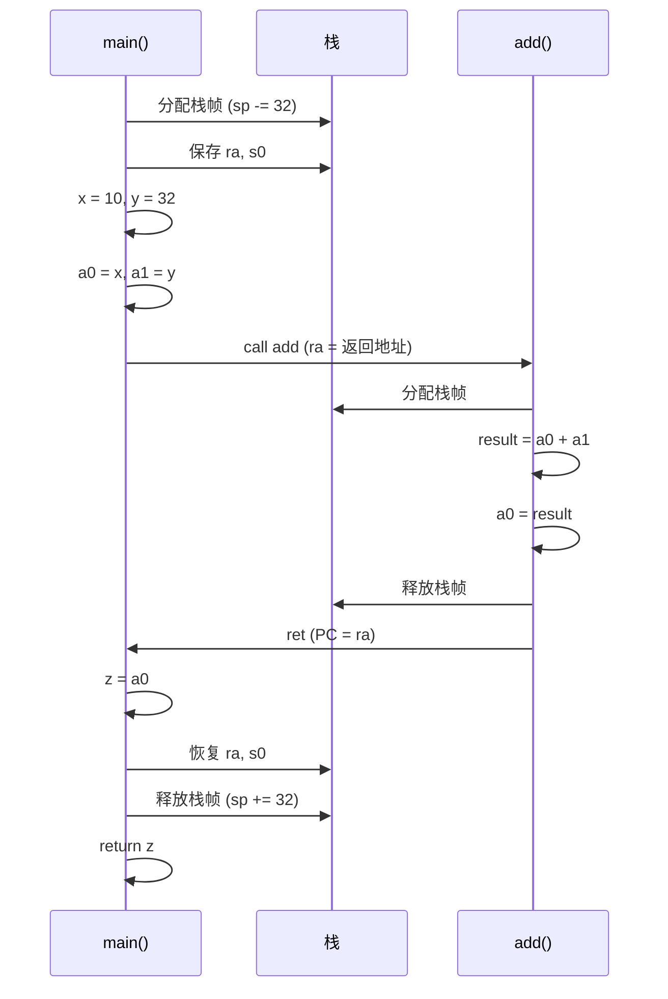
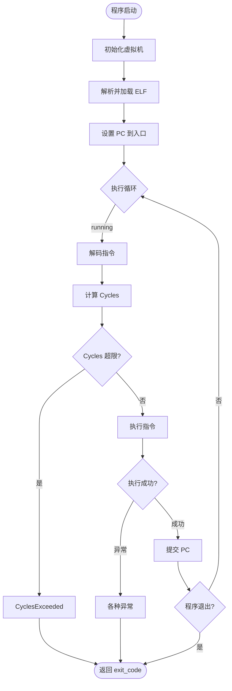

# 第五章：代码流程 - 从加载到执行的完整旅程

> 跟随一个程序的足迹，见证虚拟机内部的每一个细节

---

## 📖 本章导航

- [示例程序：return 42](#示例程序return-42)
- [第一幕：初始化](#第一幕初始化)
- [第二幕：加载程序](#第二幕加载程序)
- [第三幕：执行指令](#第三幕执行指令)
- [第四幕：退出](#第四幕退出)
- [函数调用深度剖析](#函数调用深度剖析)
- [异常处理机制](#异常处理机制)

---

## 🎯 示例程序：return 42

我们将追踪这个最简单的 C 程序在虚拟机中的完整执行过程：

```c
// simple.c
int main() {
    return 42;
}
```

### 编译为 RISC-V

```bash
riscv64-unknown-elf-gcc -o simple simple.c
riscv64-unknown-elf-objdump -d simple
```

生成的汇编代码：

```asm
0000000000010000 <_start>:
   10000: 00002117        auipc sp, 0x2          # SP = PC + 0x2000
   10004: 00010113        addi  sp, sp, 0        # SP = SP + 0
   10008: 00000513        li    a0, 0            # a0 = 0 (argc)
   1000c: 00000593        li    a1, 0            # a1 = 0 (argv)
   10010: 034000ef        jal   ra, 10044 <main>
   10014: 00050513        mv    a0, a0           # a0 = return value
   10018: 05d00893        li    a7, 93           # a7 = 93 (exit syscall)
   1001c: 00000073        ecall                  # 系统调用

0000000000010044 <main>:
   10044: fe010113        addi  sp, sp, -32      # 分配栈帧
   10048: 00113c23        sd    ra, 24(sp)       # 保存返回地址
   1004c: 00813823        sd    s0, 16(sp)       # 保存 s0
   10050: 02010413        addi  s0, sp, 32       # s0 = frame pointer
   10054: 02a00793        li    a5, 42           # a5 = 42
   10058: 00078513        mv    a0, a5           # a0 = 42 (返回值)
   1005c: 01813083        ld    ra, 24(sp)       # 恢复返回地址
   10060: 01013403        ld    s0, 16(sp)       # 恢复 s0
   10064: 02010113        addi  sp, sp, 32       # 释放栈帧
   10068: 00008067        ret                    # 返回
```

---

## 第一幕：初始化

### 🎬 场景：虚拟机启动

```rust
// 用户代码
use ckb_vm::{DefaultMachineBuilder, SupportMachine, DefaultCoreMachine};
use ckb_vm::machine::asm::{AsmMachine, AsmCoreMachine};

let asm_core = AsmCoreMachine::new(ISA_IMC, VERSION2, u64::MAX);
let mut machine = DefaultMachineBuilder::new(asm_core)
    .instruction_cycle_func(Box::new(estimate_cycles))
    .build();
```

### 内部状态

```
DefaultMachine {
    inner: DefaultCoreMachine {
        registers: [0, 0, 0, ..., 0],  // 32 个通用寄存器，全部清零
        pc: 0,                         // 程序计数器
        next_pc: 0,
        memory: WXorXMemory {
            inner: FlatMemory {
                data: [0; 4MB],        // 4MB 内存，全部清零
            },
            flags: [0; 1024],          // 1024 个页（4KB/页）
        },
        cycles: 0,
        max_cycles: u64::MAX,
        running: false,
        isa: ISA_IMC,
        version: VERSION2,
    },
    syscalls: [],
    debugger: None,
    exit_code: 0,
}
```

---

## 第二幕：加载程序

### 🎬 场景：load_program()

```rust
let program = std::fs::read("simple")?;
let program_bytes = Bytes::from(program);

machine.load_program(&program_bytes, &[])?;
```

### 步骤 1：解析 ELF

```rust
// src/elf.rs
let metadata = parse_elf::<u64>(&program_bytes, VERSION2)?;

// 解析结果
ProgramMetadata {
    entry: 0x10000,  // _start 地址
    actions: [
        LoadingAction {
            addr: 0x10000,
            size: 0x1000,
            flags: FLAG_EXECUTABLE,  // R-X
            source: Range { start: 0x1000, end: 0x2000 },
            offset_from_addr: 0,
        },
        LoadingAction {
            addr: 0x20000,
            size: 0x100,
            flags: FLAG_WRITABLE,    // RW-
            source: Range { start: 0x2000, end: 0x2100 },
            offset_from_addr: 0,
        },
    ],
}
```

### 步骤 2：加载到内存

```rust
// src/machine/mod.rs
for action in &metadata.actions {
    memory.init_pages(
        action.addr,
        action.size,
        action.flags,
        Some(program_bytes.slice(action.source)),
        action.offset_from_addr,
    )?;
}
```

**内存布局变化**：

```
地址          内容                    权限
0x00000000   [00 00 00 00 ...]       ---  未使用
0x00010000   [17 21 00 00 ...]       R-X  代码段 (.text)
             ↑ auipc 指令
0x00020000   [00 00 00 00 ...]       RW-  数据段 (.data)
0x00300000   [00 00 00 00 ...]       ---  未使用
0x003C0000   [00 00 00 00 ...]       RW-  栈区
0x00400000   ← SP 初始位置
```

### 步骤 3：初始化栈

```rust
// src/machine/mod.rs
let stack_start = (memory_size - stack_size) as u64;  // 0x003C0000
let stack_size = memory_size / 4;                     // 1MB

machine.initialize_stack(vec![], stack_start, stack_size)?;
```

**栈初始化**（args 为空）：

```
0x00400000  ← SP 初始值
  │
  ├─ 00 00 00 00 00 00 00 00  ← argc = 0
  └─ 00 00 00 00 00 00 00 00  ← argv[0] = NULL
```

### 步骤 4：设置 PC

```rust
machine.update_pc(u64::from_u64(metadata.entry));  // PC = 0x10000
machine.commit_pc();
```

**初始化完成后的状态**：

```
寄存器:
  x0  (zero) = 0x0000000000000000
  x1  (ra)   = 0x0000000000000000
  x2  (sp)   = 0x0000000000400000  ← 栈顶
  x3-x31     = 0x0000000000000000

PC = 0x0000000000010000  ← _start 入口

内存:
  0x10000: 代码段已加载
  0x20000: 数据段已加载
  0x400000: 栈已初始化

Cycles = 0
```

---

## 第三幕：执行指令

### 🎬 场景：machine.run()

```rust
let exit_code = machine.run()?;  // 开始执行
```

### 执行循环

```rust
// src/machine/mod.rs
while self.running() {
    self.step(decoder)?;
}
```

### 逐指令追踪

#### 指令 1: auipc sp, 0x2 (PC=0x10000)

```
解码:
  opcode = OP_AUIPC
  rd = x2 (sp)
  imm = 0x2000

执行:
  sp = PC + imm
     = 0x10000 + 0x2000
     = 0x12000

更新:
  x2 (sp) = 0x12000
  PC = 0x10004
  Cycles += 1
```

**为什么**：AUIPC (Add Upper Immediate to PC) 用于计算相对地址，这里是为了设置栈指针。

---

#### 指令 2: addi sp, sp, 0 (PC=0x10004)

```
解码:
  opcode = OP_ADDI
  rd = x2 (sp)
  rs1 = x2 (sp)
  imm = 0

执行:
  sp = sp + 0
     = 0x12000 + 0
     = 0x12000

更新:
  x2 (sp) = 0x12000  (不变)
  PC = 0x10008
  Cycles += 1
```

**为什么**：这是一条 NOP 指令（实际上是对齐或占位）。

---

#### 指令 3: li a0, 0 (PC=0x10008)

```
解码:
  实际指令: addi a0, x0, 0
  opcode = OP_ADDI
  rd = x10 (a0)
  rs1 = x0 (zero)
  imm = 0

执行:
  a0 = zero + 0
     = 0

更新:
  x10 (a0) = 0
  PC = 0x1000C
  Cycles += 1
```

**为什么**：初始化 argc = 0。

---

#### 指令 4: li a1, 0 (PC=0x1000C)

```
执行:
  a1 = 0

更新:
  x11 (a1) = 0
  PC = 0x10010
  Cycles += 1
```

**为什么**：初始化 argv = NULL。

---

#### 指令 5: jal ra, 10044 <main> (PC=0x10010)

```
解码:
  opcode = OP_JAL
  rd = x1 (ra)
  imm = 0x34  (相对偏移)

执行:
  ra = PC + 4
     = 0x10010 + 4
     = 0x10014

  PC = PC + imm
     = 0x10010 + 0x34
     = 0x10044

更新:
  x1 (ra) = 0x10014  ← 返回地址
  PC = 0x10044       ← 跳转到 main
  Cycles += 1
```

**为什么**：JAL (Jump and Link) 用于函数调用，保存返回地址到 ra。

**栈帧状态**（进入 main 前）：

```
SP = 0x12000

寄存器:
  ra = 0x10014  ← 返回到 _start
  a0 = 0        ← argc
  a1 = 0        ← argv
```

---

### 🔍 main 函数执行

#### 指令 6: addi sp, sp, -32 (PC=0x10044)

```
执行:
  sp = sp - 32
     = 0x12000 - 32
     = 0x11FE0

更新:
  x2 (sp) = 0x11FE0
  PC = 0x10048
  Cycles += 1
```

**为什么**：为 main 函数分配 32 字节的栈帧。

**栈帧布局**：

```
高地址
0x12000  ← 旧 SP
  │
  ├─ [未使用] (8 bytes)
  ├─ [ra]     (8 bytes)  ← SP+24
  ├─ [s0]     (8 bytes)  ← SP+16
  ├─ [局部变量] (16 bytes)
  └─ 0x11FE0  ← 新 SP
低地址
```

---

#### 指令 7: sd ra, 24(sp) (PC=0x10048)

```
解码:
  opcode = OP_SD (Store Doubleword)
  rs1 = x2 (sp)
  rs2 = x1 (ra)
  imm = 24

执行:
  addr = sp + 24
       = 0x11FE0 + 24
       = 0x11FF8

  memory[0x11FF8] = ra
                  = 0x10014

更新:
  内存[0x11FF8] = 0x0000000000010014
  PC = 0x1004C
  Cycles += 2
```

**为什么**：保存返回地址到栈上，以便函数返回时恢复。

---

#### 指令 8: sd s0, 16(sp) (PC=0x1004C)

```
执行:
  memory[0x11FE0 + 16] = s0
  memory[0x11FF0] = 0

更新:
  内存[0x11FF0] = 0x0000000000000000
  PC = 0x10050
  Cycles += 2
```

**为什么**：保存 s0 寄存器（frame pointer）。

---

#### 指令 9: addi s0, sp, 32 (PC=0x10050)

```
执行:
  s0 = sp + 32
     = 0x11FE0 + 32
     = 0x12000

更新:
  x8 (s0) = 0x12000
  PC = 0x10054
  Cycles += 1
```

**为什么**：设置 frame pointer 指向栈帧顶部。

---

#### 指令 10: li a5, 42 (PC=0x10054)

```
执行:
  a5 = 42

更新:
  x15 (a5) = 42
  PC = 0x10058
  Cycles += 1
```

**为什么**：加载常量 42 到临时寄存器 a5。

---

#### 指令 11: mv a0, a5 (PC=0x10058)

```
解码:
  实际指令: addi a0, a5, 0

执行:
  a0 = a5 + 0
     = 42

更新:
  x10 (a0) = 42  ← 返回值
  PC = 0x1005C
  Cycles += 1
```

**为什么**：RISC-V 调用约定规定返回值放在 a0 寄存器。

---

#### 指令 12: ld ra, 24(sp) (PC=0x1005C)

```
执行:
  ra = memory[sp + 24]
     = memory[0x11FF8]
     = 0x10014

更新:
  x1 (ra) = 0x10014
  PC = 0x10060
  Cycles += 2
```

**为什么**：从栈恢复返回地址。

---

#### 指令 13: ld s0, 16(sp) (PC=0x10060)

```
执行:
  s0 = memory[0x11FF0]
     = 0

更新:
  x8 (s0) = 0
  PC = 0x10064
  Cycles += 2
```

**为什么**：从栈恢复 s0。

---

#### 指令 14: addi sp, sp, 32 (PC=0x10064)

```
执行:
  sp = sp + 32
     = 0x11FE0 + 32
     = 0x12000

更新:
  x2 (sp) = 0x12000  ← 释放栈帧
  PC = 0x10068
  Cycles += 1
```

**为什么**：释放 main 函数的栈帧。

---

#### 指令 15: ret (PC=0x10068)

```
解码:
  实际指令: jalr x0, 0(ra)

执行:
  PC = ra + 0
     = 0x10014 + 0
     = 0x10014

更新:
  PC = 0x10014  ← 返回到 _start
  Cycles += 1
```

**为什么**：返回到调用者 (_start)。

---

### 🔙 返回 _start

#### 指令 16: mv a0, a0 (PC=0x10014)

```
执行:
  a0 = a0
     = 42  (不变)

更新:
  PC = 0x10018
  Cycles += 1
```

**为什么**：这是一条 NOP，确保返回值在 a0 中（实际上已经在了）。

---

#### 指令 17: li a7, 93 (PC=0x10018)

```
执行:
  a7 = 93

更新:
  x17 (a7) = 93  ← syscall 编号
  PC = 0x1001C
  Cycles += 1
```

**为什么**：准备调用 exit syscall（编号 93）。

---

#### 指令 18: ecall (PC=0x1001C)

```
解码:
  opcode = OP_ECALL

执行:
  machine.ecall()?

  // 在 DefaultMachine::ecall() 中
  let code = registers[A7].to_u64();  // 93

  if code == 93 {
      exit_code = registers[A0].to_i8();  // 42
      set_running(false);  // 停止执行循环
  }

更新:
  exit_code = 42
  running = false
  Cycles += 500  (syscall 开销)
```

**为什么**：系统调用 exit(42)，程序正常退出。

---

## 第四幕：退出

### 🎬 场景：程序结束

```rust
// machine.run() 返回
let exit_code = machine.run()?;

println!("Program exited with code: {}", exit_code);  // 42
```

### 最终状态

```
寄存器:
  x0  (zero) = 0
  x1  (ra)   = 0x10014
  x2  (sp)   = 0x12000
  x10 (a0)   = 42  ← 返回值
  x17 (a7)   = 93

PC = 0x1001C

Cycles = 约 520  (具体取决于 cycle function)

Exit Code = 42
```

---

## 函数调用深度剖析

### 🔬 RISC-V 调用约定

```
寄存器分类:

调用者保存 (Caller-saved):
  a0-a7   (x10-x17)  参数 / 返回值
  t0-t6   (x5-x7, x28-x31)  临时寄存器

被调用者保存 (Callee-saved):
  s0-s11  (x8-x9, x18-x27)  保存寄存器
  ra      (x1)  返回地址
  sp      (x2)  栈指针
```

### 栈帧结构

```c
// 示例：带参数和局部变量的函数
int add(int a, int b) {
    int result = a + b;
    return result;
}
```

**栈帧布局**：

```
高地址 (旧 SP)
  │
  ├─ [调用者的栈帧]
  │
  ├─ 参数区 (如果超过 8 个参数)
  ├─ 返回地址 (ra)
  ├─ 保存的寄存器 (s0, s1, ...)
  ├─ 局部变量 (result)
  ├─ 临时空间
  └─ 新 SP
低地址
```

### 完整调用示例

```c
// caller.c
int add(int a, int b);

int main() {
    int x = 10;
    int y = 32;
    int z = add(x, y);  // 调用 add
    return z;
}
```

**汇编代码**：

```asm
main:
    addi  sp, sp, -32      # 分配栈帧
    sd    ra, 24(sp)       # 保存 ra
    sd    s0, 16(sp)       # 保存 s0

    li    a5, 10           # x = 10
    sw    a5, 12(sp)       # 存储 x 到栈

    li    a5, 32           # y = 32
    sw    a5, 8(sp)        # 存储 y 到栈

    lw    a0, 12(sp)       # 加载 x 到 a0 (第一个参数)
    lw    a1, 8(sp)        # 加载 y 到 a1 (第二个参数)

    call  add              # 调用 add(10, 32)

    sw    a0, 4(sp)        # 存储返回值到 z
    lw    a5, 4(sp)        # 加载 z
    mv    a0, a5           # 返回 z

    ld    ra, 24(sp)       # 恢复 ra
    ld    s0, 16(sp)       # 恢复 s0
    addi  sp, sp, 32       # 释放栈帧
    ret
```

**执行流程图**：



---

## 异常处理机制

### 🛡️ 异常类型

CKB-VM 支持的异常：

| 异常类型 | 触发条件 | 示例 |
|---------|---------|------|
| **MemOutOfBound** | 访问超出内存范围 | `lw a0, 0x500000` (超过 4MB) |
| **MemUnaligned** | 未对齐访问 | `lw a0, 0x10001` (未 4 字节对齐) |
| **MemWriteOnExecutablePage** | 写入可执行页 | WXorX 冲突 |
| **InvalidInstruction** | 非法指令 | `0xFFFFFFFF` |
| **InvalidEcall** | 未知系统调用 | `ecall` with a7=999 |
| **CyclesExceeded** | 超出 Cycles 限制 | 执行时间过长 |

### 异常处理流程

```rust
// src/machine/mod.rs
pub fn step<D: InstDecoder>(&mut self, decoder: &mut D) -> Result<(), Error> {
    // 保存当前 PC
    let current_pc = self.pc().to_u64();

    // 1. 解码指令
    let instruction = decoder.decode(self.memory_mut(), current_pc)?;

    // 2. 计费
    let cycles = self.instruction_cycle_func()(instruction);
    self.add_cycles(cycles)?;  // 可能抛出 CyclesExceeded

    // 3. 更新 next_pc
    self.update_pc(/* ... */);

    // 4. 执行指令
    execute(instruction, self)?;  // 可能抛出各种异常

    // 5. 提交 PC（只有成功才会到这里）
    self.commit_pc();

    Ok(())
}
```

**关键点**：
- ✅ **异常安全**：如果执行失败，PC 不会改变（因为只更新了 next_pc）
- ✅ **原子性**：要么完全成功，要么完全失败
- ✅ **可恢复**：调用者可以捕获异常并决定如何处理

### 异常示例 1：内存越界

```rust
// 恶意程序尝试访问非法内存
// lw a0, 0x500000

执行流程:
1. 解码成功: OP_LW, a0, offset=0x500000
2. 计费成功: cycles += 2
3. 执行 execute_lw():
   - 计算地址: 0x500000
   - 调用 memory.load32(0x500000)
   - ❌ 错误: 0x500000 >= memory_size (0x400000)
   - 返回 Err(MemOutOfBound(0x500000))

结果:
- PC 保持不变（因为 commit_pc 未执行）
- 虚拟机状态未改变
- 返回错误给调用者
```

### 异常示例 2：WXorX 冲突

```rust
// 恶意程序尝试修改代码段
// sw a0, 0x10000  (代码段地址)

执行流程:
1. 解码成功: OP_SW, a0, 0x10000
2. 计费成功: cycles += 2
3. 执行 execute_sw():
   - 计算地址: 0x10000
   - 调用 memory.store32(0x10000, value)
   - WXorXMemory::store32() 检查:
     page = 0x10000 / 4096 = 4
     flags[4] = FLAG_EXECUTABLE
     ❌ 错误: 不能写入可执行页
   - 返回 Err(MemWriteOnExecutablePage(4))

结果:
- 成功阻止代码注入攻击
- 程序终止
```

### 异常示例 3：Cycles 超限

```rust
// 死循环程序
// loop: jal loop

let mut machine = create_machine();
machine.set_max_cycles(1000);  // 限制 1000 cycles

执行流程:
1. 第 1 次循环: cycles = 1
2. 第 2 次循环: cycles = 2
3. ...
4. 第 1000 次循环: cycles = 1000
5. 第 1001 次循环:
   - add_cycles(1)
   - new_cycles = 1001 > max_cycles
   - ❌ 返回 Err(CyclesExceeded)

结果:
- 防止 DOS 攻击
- 程序终止
```

---

## 🎬 完整执行流程总结

### 泳道图



### 关键指标统计

**示例程序 (return 42) 执行统计**：

```
总指令数: 18 条
  - 算术指令: 7 条 (addi, li, mv)
  - 内存访问: 4 条 (sd, ld)
  - 跳转指令: 2 条 (jal, ret)
  - 系统调用: 1 条 (ecall)
  - NOP: 4 条

总 Cycles: ~520
  - 算术指令: 7 cycles
  - 内存访问: 8 cycles (每条 2 cycles)
  - 跳转指令: 2 cycles
  - 系统调用: 500 cycles
  - NOP: 3 cycles

内存访问:
  - 读取: 10 次 (4次 ld + 6次取指令)
  - 写入: 2 次 (2次 sd)

寄存器使用:
  - 临时寄存器: a0, a1, a5, a7
  - 保存寄存器: s0, ra, sp
```

---

## 🔬 专家深度讨论

### 话题 1：为什么需要两阶段 PC 更新？

**场景**：跳转指令中的异常

```rust
// 假设只有一个 PC
fn execute_jalr(inst: Instruction, machine: &mut Machine) -> Result<(), Error> {
    let target = calculate_target()?;  // 可能失败
    machine.set_pc(target);  // ❌ 如果后续失败，PC 已被修改！

    // 其他操作...
    some_operation_that_might_fail()?;  // 💥 失败了！

    Ok(())
}
```

**问题**：PC 已被修改，但指令执行失败，状态不一致！

**解决**：两阶段提交

```rust
fn execute_jalr(inst: Instruction, machine: &mut Machine) -> Result<(), Error> {
    let target = calculate_target()?;
    machine.update_pc(target);  // ✅ 只更新 next_pc

    some_operation_that_might_fail()?;  // 💥 失败了！
    // PC 仍然是旧值，状态一致

    Ok(())
}

// 在 step() 中
execute(inst, machine)?;
machine.commit_pc();  // ✅ 只有成功才提交
```

---

### 话题 2：栈帧优化

**问题**：为什么 main 函数需要 32 字节栈帧，而只用了 16 字节？

**答案**：RISC-V ABI 要求栈帧 **16 字节对齐**。

```
实际使用:
  8 bytes (ra)
+ 8 bytes (s0)
= 16 bytes

对齐要求:
  16 bytes → 向上取整到 16 的倍数 = 16 bytes

但编译器分配了 32 bytes，为什么？

原因:
  - 预留局部变量空间（虽然这个例子没用到）
  - 编译器的保守策略（-O0 优化级别）

优化后 (-O2):
  - 编译器会内联 main
  - 栈帧可能被完全消除
```

---

### 话题 3：Cycles 计量的公平性

**问题**：不同指令的 Cycles 成本如何定义？

**CKB-VM 的策略**：

```rust
pub fn estimate_cycles(inst: Instruction) -> u64 {
    match extract_opcode(inst) {
        OP_ADD | OP_SUB => 1,        // 算术运算：1 cycle
        OP_MUL | OP_MULH => 5,       // 乘法：5 cycles
        OP_DIV | OP_REM => 32,       // 除法：32 cycles (模拟硬件)
        OP_LD | OP_SD => 2,          // 内存访问：2 cycles
        OP_JAL | OP_JALR => 1,       // 跳转：1 cycle
        OP_ECALL => 500,             // 系统调用：500 cycles (高开销)
        _ => 1,
    }
}
```

**依据**：
- 📐 **相对开销**：基于真实硬件的相对时间
- ⚖️ **公平计费**：复杂操作（除法、syscall）收费更高
- 🎯 **防 DOS**：限制总 Cycles，防止无限循环

---

## 🔜 下一章预告

在[第六章《技术亮点：性能优化黑科技》](06_highlights.md)中，我们将揭秘：

- 🚀 **Macro-Op Fusion**
  - 如何将 5 条指令融合为 1 条
  - 性能提升 15-20% 的秘密

- 💾 **指令缓存算法**
  - 平衡局部性和全局性的 Hash 函数
  - 缓存命中率 > 95%

- 🌳 **零成本泛型**
  - Rust 编译器的魔法
  - 如何做到无运行时开销

- ⚡ **无分支条件跳转**
  - 位掩码技巧
  - 避免 CPU 分支预测失败

---

## 📚 扩展阅读

### 入门资料
- [RISC-V Calling Convention](https://riscv.org/wp-content/uploads/2015/01/riscv-calling.pdf)
- [Understanding Stack Frames](https://eli.thegreenplace.net/2011/09/06/stack-frame-layout-on-x86-64)

### 深度阅读
- [Exception Handling in Virtual Machines](https://www.usenix.org/legacy/events/vee05/full_papers/p72-gal.pdf)
- [Transactional Memory for VM](https://dl.acm.org/doi/10.1145/1791194.1791211)

### 调试工具
- `riscv64-unknown-elf-objdump -d` - 反汇编工具
- `riscv64-unknown-elf-gdb` - GDB 调试器
- `spike` - RISC-V 指令集模拟器

---

**继续下一章** → [第六章：技术亮点](06_highlights.md)
